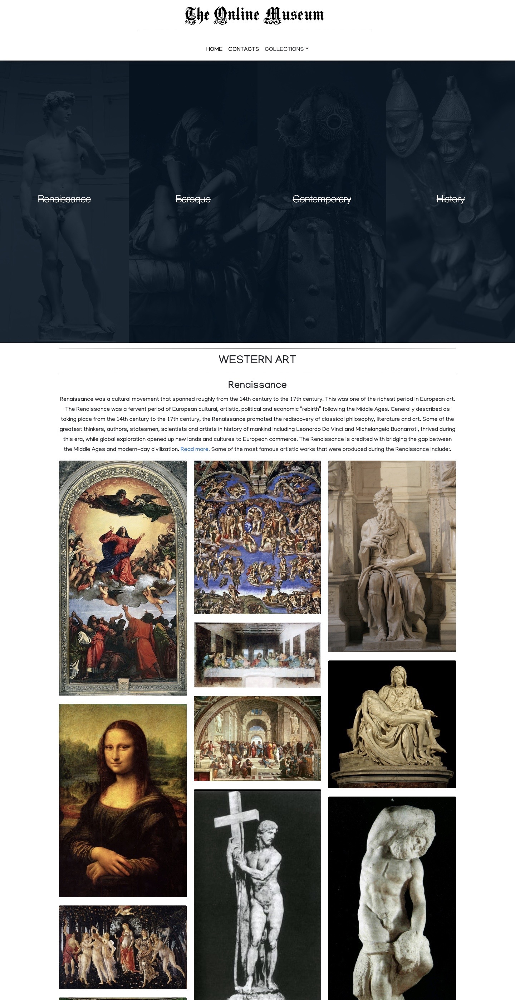

# The Online Museum
### Authors
* **[Collins Muriuki.](https://github.com/collinsmuriuki?tab=repositories)**
* **[Isaac Gichuru.](https://github.com/Isaacg94)**
* **[James Ngari.](https://github.com/Jay-68)**
* **[Brian Omondi.](https://github.com/Brian23-eng)**  
* **[Dennis Karobia.](https://github.com/karobia001)**

#### Version v1.0
Visit this [link](https://collinsmuriuki.github.io/online-museum/) to check out our Online Museum website.

## Description
How can we ease public accessibility to art? An online museum art gallery would provide an opportunity to discover the defining and best of world art. It would provide accountability for the evolution of art.
Clearly, it would be the first of its kind nationally, perhaps internationally.
[The Online museum landing page](https://collinsmuriuki.github.io/online-museum/)

## Setup/Installation Requirements
Here is a run through of how to set up the application:
* Step 1 : Clone this repository using the git clone link:
  * **`git clone https://github.com/collinsmuriuki/online-museum.git`**
* Step 2 : Navigate to the directory:
  * **`cd online museum`**
* Step 3 : Open the directory created with your favorite IDE. If Atom type **`atom .`** if VSCode type **`code .`** . This will lauch the editor with the project setup,
* Now feel free to hack around the project.

## Features
* After the webpage loads, the user will be able to :
    - Get a brief introduction of the collections in the landing page.
    - Follow on any of the links in the navigation bar to access its contents.
    - Get more information about a given item by clicking on the art work.
    - Sign up to our free newsletter in the contacts section and get a success alert.

## Technologies Used
* **HTML5** - For the websites basic markup and content.
* **CSS** - For the basic styling of the web page.
* **Bootstrap** and **mdbootstrap** - For the responsiveness, alignment of page content and awesomeness of the web page.
* **Javascript** and **jQuery** - For the page functionality and animations.
* **Wow.js**
* **Animate.css**

## Behaviour Driven Development (BDD)
| User Input     |Behaviour |
|--------- |-------------|
|  Clicks on the navigation links |Gets directed to the corresponding page section |
|  Hovers over the images in the landing page |Gets the title of the collection and a brief description. |
 | Clicks on an image | Gets information on the art piece through a modal |
|  Clicks on the subscribe button | Gets a modal form to fill and is alerted on submision|

## Support and Contact Details
Reach us at any of these emails:
* 7248zack@gmail.com
* murerwacollins@gmail.com
* ngari.james.n@gmail.com
* b.odhiambo.bo@gmail.com
* karobiamaina81@gmail.com

*MIT License* 
&copy; The Online Museum.
